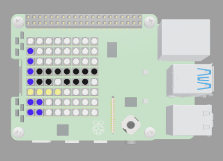

## Introduction

In this project, you will create a series of images using the RGB LEDs on the Sense HAT LED matrix which can be cycled to create your own animation.

Animation is a method of tricking your brain into seeing movement by swapping still images very quickly in front of your eyes. A series of still images with minor changes in each one is shown quickly in sequence, and we see this as a moving picture - it's a lot like how movies work.

You will:
+ Choose colours and set them as variables in your code
+ Create images on the SenseHAT array
+ Cycle images to create an animation

--- no-print ---
--- task ---
### Try it

  
This project shows a short animation of a chicken putting on sunglasses, made of multiple frames on the SenseHAT display.

<iframe src="https://trinket.io/embed/python/c82ac216d4" width="100%" height="600" frameborder="0" marginwidth="0" marginheight="0" allowfullscreen></iframe>

--- /task ---

--- /no-print ---

--- print-only ---

--- /print-only ---
