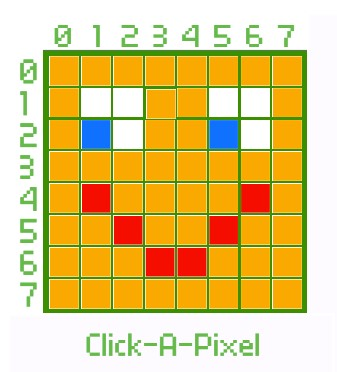

## Encode an image

In this step, you will design your own image to display on the LED array, then code it! 

<iframe src="https://trinket.io/embed/python/05d0606c5d?outputOnly=true&runOption=run&start=result" width="100%" height="600" frameborder="0" marginwidth="0" marginheight="0" allowfullscreen></iframe>

To help you design an image that will fit on the LED array, we have created a simple tool in Scratch. You can show different colours by clicking on each square in the array that appears.

--- task ---

**Try:** Use the Pick-a-Pixel tool to design an image you would like to animate.

**Tip:** Don't make it too complex, or it will be hard to make out on the LED array (and difficult to animate).

(<iframe src="https://scratch.mit.edu/projects/715438479/embed" allowtransparency="true" width="485" height="402" frameborder="0" scrolling="no" allowfullscreen></iframe>)

--- /task ---

Once you have designed your image, it needs to be encoded into a list of values python can use to light the LEDs on the SenseHAT.

You will need to copy the list of colours on the pixels of your image into your python program in the correct order.

--- task ---

**Type:** Name your list `image`. On the line beneath `#Define image` insert a blank line by pressing Enter and type:

--- code ---
---
language: python
filename: main.py
line_numbers: true
line_number_start: 
line_highlights: 
---

#Define image
image = [
--- /code ---

and press Enter.

--- /task ---

--- task ---

On the new line that appears, copy the top line of your pixel image across using only the first letter of the colour you have used, followed by a comma.

{:width=300px}

Using this image as an example, the first line consists of eight orange pixels:

--- code ---
---
language: python
filename: main.py
line_numbers: true
line_number_start: 
line_highlights: 
---

#Define image
image = [
    o,o,o,o,o,o,o,o,
--- /code ---
Once you have copied the first row of pixels, press Enter. 

**Tip:** Make sure that you have a comma between each letter **and at the end of the line**.

--- /task ---

Because of the way python handles **white space**, it will not notice that you have continued your list on the next line. We format our code in this way to make it easier to understand how it will display on the LED matrix and to debug if something goes wrong.

--- task ---

**Type:** Copy the next seven rows of pixels from your image into your program, making sure you have a comma between each letter and at the end of each line.

Using the smiling face image above, your code would look like this:

--- code ---
---
language: python
filename: main.py
line_numbers: true
line_number_start: 
line_highlights: 
---

#Define image
image = [
    o,o,o,o,o,o,o,o,
    o,w,w,o,o,w,w,o,
    o,b,w,o,o,b,w,o,
    o,o,o,o,o,o,o,o,
    o,r,o,o,o,o,r,o,
    o,o,r,o,o,r,o,o,
    o,o,o,r,r,o,o,o,
    o,o,o,o,o,o,o,o
    ]

--- /code ---

Can you see the face in the code?

--- /task ---

--- task ---

**Edit:** Change the argument in your final line to the name of your list:

--- code ---
---
language: python
filename: main.py
line_numbers: true
line_number_start: 
line_highlights: 
---

#Display Image
sense.set_pixels(image)

--- /code ---

--- /task ---

--- task ---

**Test:** Run your code. You should see the image you designed appear on the array!

--- /task ---

--- task ---

**Debug:** 
+ What does your error message say? Which line has an error?
+ Does your code match the code above?

--- collapse ---
---
title: NameError
---

+ Have you got the right letters in your list?
+ Have you defined all the colours you are using?
+ Have you spelled the name of your image correctly in `sense.set_pixels(image)`?

--- /collapse ---

--- collapse ---
---
title: SyntaxError
---

+ Have you got commas on the end of each line of your image list?
+ Are you missing any square brackets at the beginning and end of your image list? `[ ]`

--- /collapse ---

--- /task ---

--- save ---